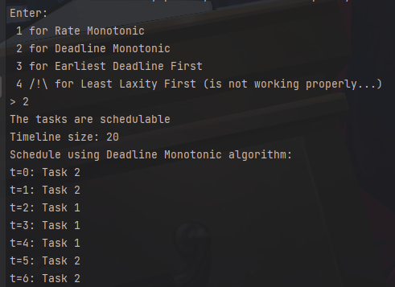

<H1>Scheduling Tasks</H1>

[![Language][langue-shield]][issues-url]
[![Issues][issues-shield]][issues-url]

---

In this project, I implemented some algorithms for scheduling tasks.

## Structure

not yet.

## Algorithms

- [x] Rate Monothonic
- [x] Deadline Monotonic
- [x] Earliest Deadline First
- [] Least Laxity First : code is not working :/

PS: I wasn't able to implement LLF for now. I will try to fix it later.

<!-- MARKDOWN LINKS & IMAGES -->
[langue-shield]: https://img.shields.io/badge/Language-C++-lightblue.svg?style=for-the-badge&logo=c%2B%2B
[issues-url]: https://github.com/PhantHive/scheduling-tasks/issues/
[issues-shield]: https://img.shields.io/github/issues/PhantHive/scheduling-tasks?style=for-the-badge

